# Playing cards object detection model 

### Developing a model that can detect multiple cards and identify their suit and rank.

by Teodor Kostadinov, 4MI0600097, 
Faculty of Mathematics and Informatics, Sofia University

---
# Staging

_**Imagine** that you are a Software engineer with a great business idea..._

---

# The business idea

Developing an application that can:
- assist during a game of Blackjack, Bridge, Belot, Poker, etc.

---

# Plan

To create the application a model recognizing the playing cards is required.
A **fast implementation** of the required model is needed as soon as possible to develop the business!

---

# Problem #1

Since the business **is just starting**, no senior Data science team members are currently available.
There is no advanced knowledge on the topic, **nor time** to develop a model from scratch.

---

# Solution to Problem #1

Use a popular **pretrained model** and a **library** that allows easy access to ease the implementation.
In our case:
- **YOLOv8** model
- **Pyhton ultralytics** library

---
# Problem #2 

There is **no public dataset** available.*
There is no time to create a big dataset, with well-designed examples for training, nor time to label them.

---
# Finding a dataset

A person, facing the same problem, has created a synthetic dataset with over 20,000 images. [Link](https://www.kaggle.com/datasets/andy8744/playing-cards-object-detection-dataset) to dataset in kaggle

> First I took 20-30 second videos of all 52 cards under variable light temperature and brightness. The images were processed with open-cv. The DTD dataset (https://www.robots.ox.ac.uk/~vgg/data/dtd/) was used to simulate backgrounds of various textures for our dataset.

--- 
# Examples of the images

A set of 1, 2 or 3 cards together placed on different backgrounds.

---
# Examples of the images

Since the dataset is generated programmatically, there are obvious patterns.

---

# Our YOLOv8m_synthetic model

- Trained on **YOLOv8 medium** using 10 epochs
- Trained with **20 000 images** split 70/20/10 and 52 classes.
- **2 hours training** time on NVIDIA RTX A2000 8GB Laptop GPU.
- Can detect each card from the test set with **~99%** accuracy.

---
# Our YOLOv8m_synthetic model statistics

The results are impressive on paper:

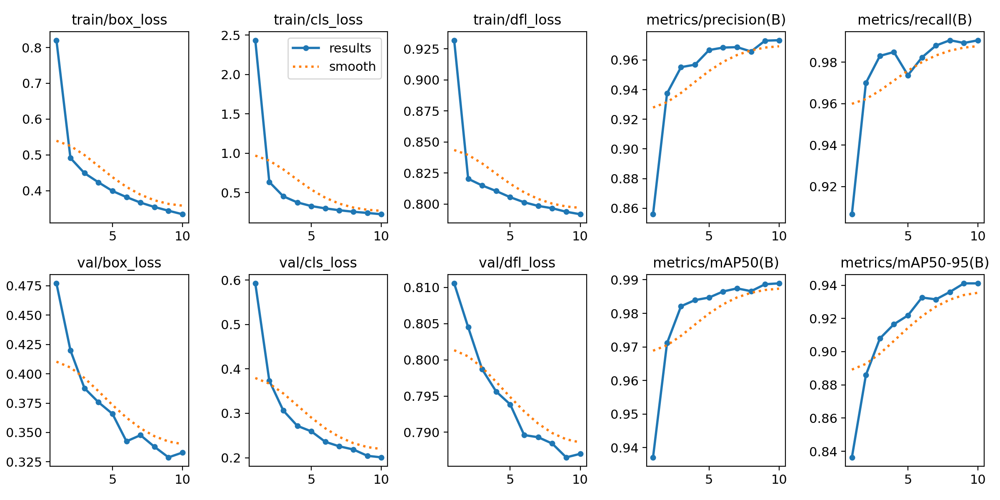

---
# Our YOLOv8m_synthetic in practice

Working pretty good on similar style pictures:

---
# Our YOLOv8m_synthetic in practice

---
# Our YOLOv8m_synthetic in practice

---
# Our YOLOv8m_synthetic in practice

When the images differ from the synthetic format the results drop as well:

---
# Our YOLOv8m_synthetic in practice

It can also detect printings of a train data but not other types of cards:

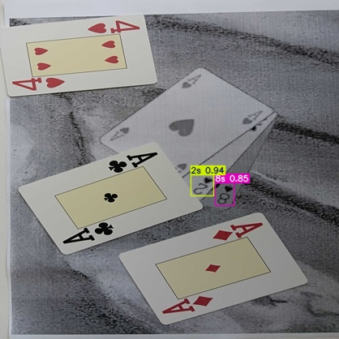

---
# Creating own small dataset

The dataset is created with **"real" life** examples of cards.
Since 52 classes of cards require a lot of data - the classes were **cut to 13** (Hearts only).

---
# Our real dataset examples

Captured and labeled **100** photos with different configurations of cards.

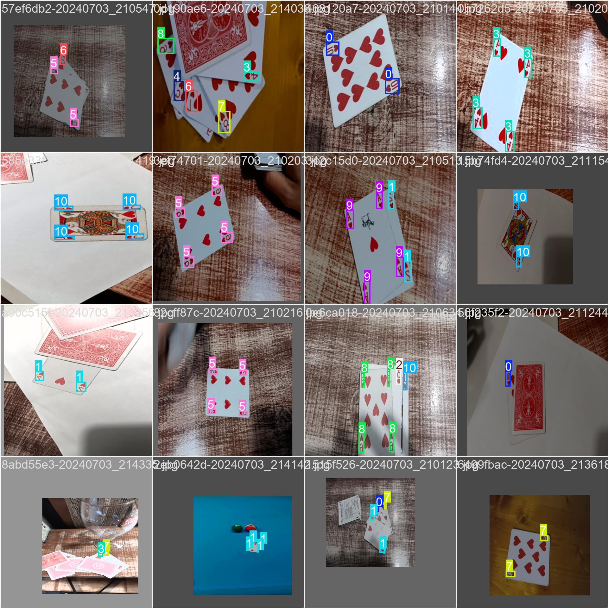

---
# Our YOLOv8m_real model

- Trained on YOLOv8 medium using **100** epochs
- Trained with **100 images** split 70/20/10 and 13 classes.
- **20 minutes training** time on NVIDIA RTX A2000 8GB Laptop GPU.
- Results are not quite impressive but this is expected as the low number of data entries.

---
# Our YOLOv8m_real model statistics

The results are impressive on paper:

---
# Our YOLOv8m_real on test set

The test set is not perfect, there are a handful of mistakes. 

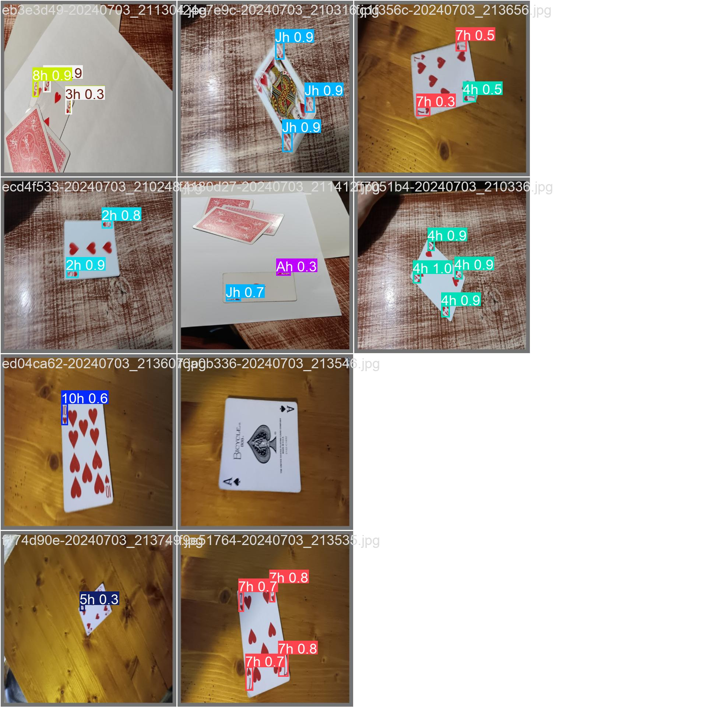

---
# Our YOLOv8m_real in practice

It is doing ok on images with Hearts, but not as good as YOLOv8m_synthetic

---
# Our YOLOv8m_real in practice

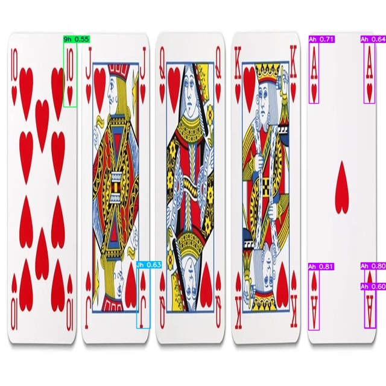

---
# Our YOLOv8m_real in practice

However, it does confuse other suits for Hearts.

---
# Our YOLOv8m_real in practice

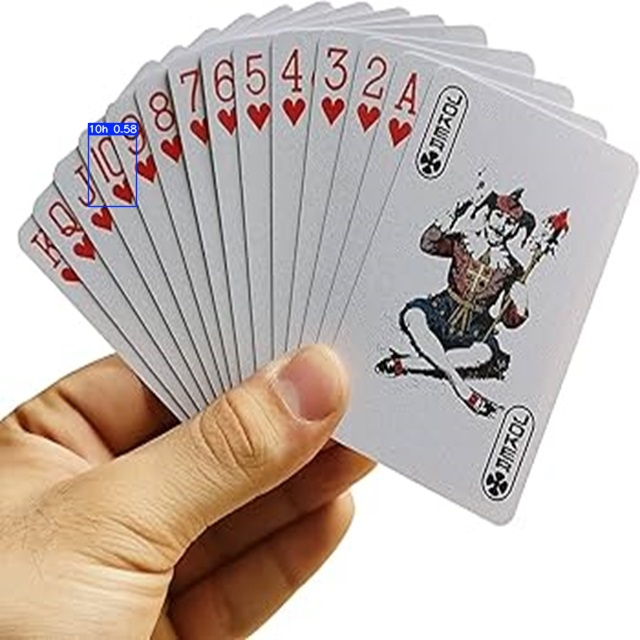

---
# Augmented dataset workaround

Developed a Python script that **transforms the images** in a dataset, effectively multiplying the dataset.
The library used to transform the marked bounding boxes in the original dataset correctly to the augmented one is: [***imgaug***](https://imgaug.readthedocs.io/en/latest/)

---

# Augmented dataset example

---
# Our YOLOv8m_aug model

- Trained on YOLOv8 medium using **100** epochs
- Trained with **1000 images** split 70/20/10 and 13 classes.
- **40 minutes training** time on NVIDIA RTX A2000 8GB Laptop GPU.
- Results are questionable - similar to the model without augmentation.

---
# Our YOLOv8m_aug model statistics

Observing similar mAP50 and mAP50-95 percents as YOLOv8m_real.

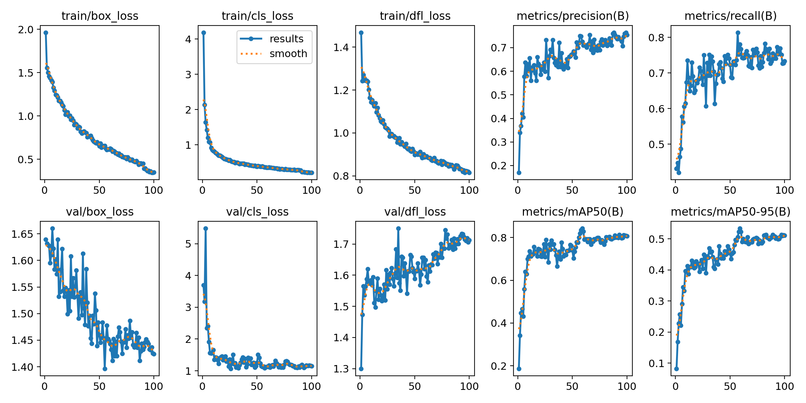

---
# Our YOLOv8m_aug on test set

It is still making similar mistakes to the previous model:

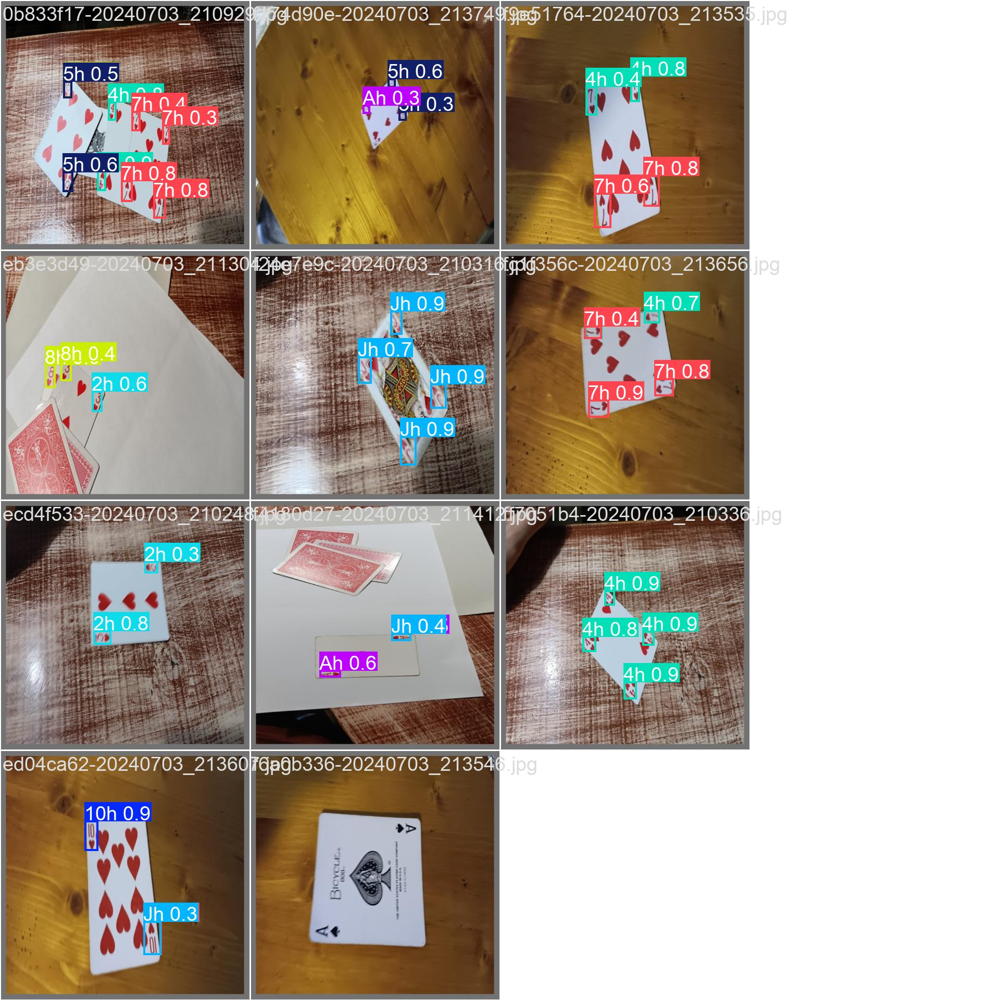

---
# Our YOLOv8m_aug in practice

It still does not detect the Ace, loses the King though.

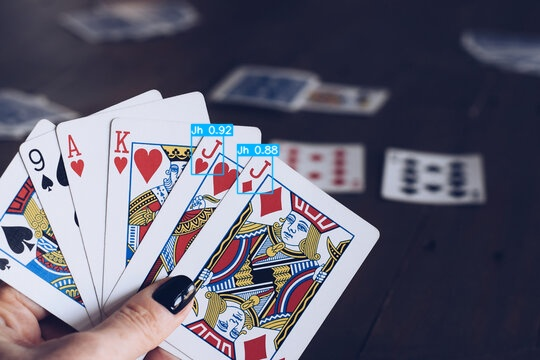

---

# Combining the datasets

Combined the synthetic and "real" datasets, taking all **100 images** from the "real" dataset and **10 times more** from the synthetic one.
Developed a script the **relabels** all 52 classes **to the 13** from the "real" one, dropping all classes that are not Hearts.

---
# Our YOLOv8m_comb model

- Trained on YOLOv8 medium using **100** epochs
- Trained with **1100 images** split 70/20/10 and 13 classes.
- **50 minutes training** time on NVIDIA RTX A2000 8GB Laptop GPU.
- Results are worse than the synthetic model.

---
# Our YOLOv8m_comb model statistics

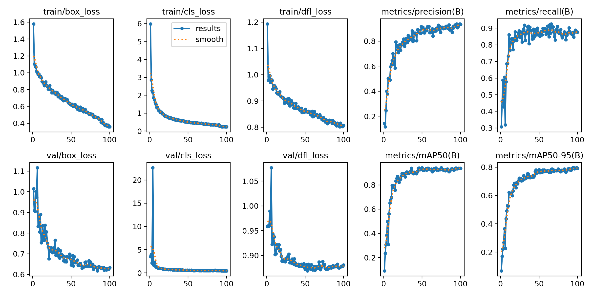

---
# Our YOLOv8m_comb on test set

It is doing fine on the test set, detecting only Hearts.

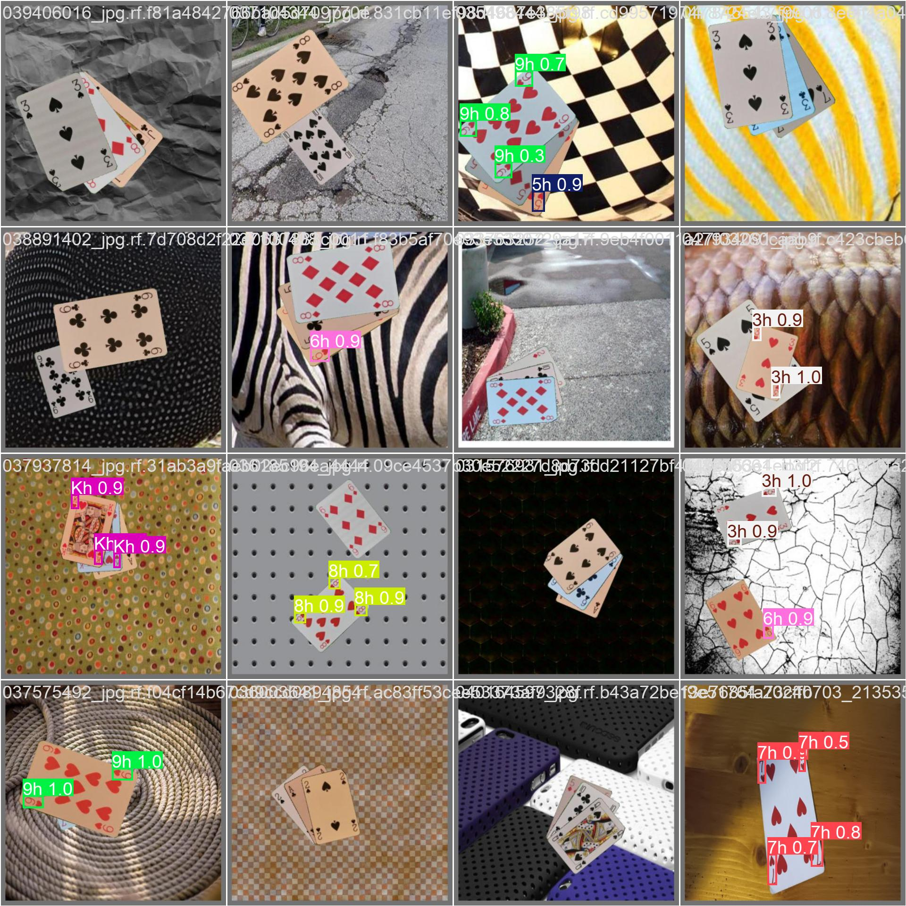

---
# Our YOLOv8m_comb in practice

Doing similarly to the other models in some situations.

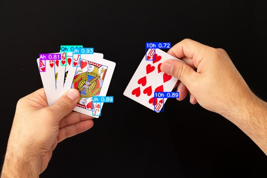

---

# Our YOLOv8m_comb in practice

The model managed to detect the Ace, but not the King:

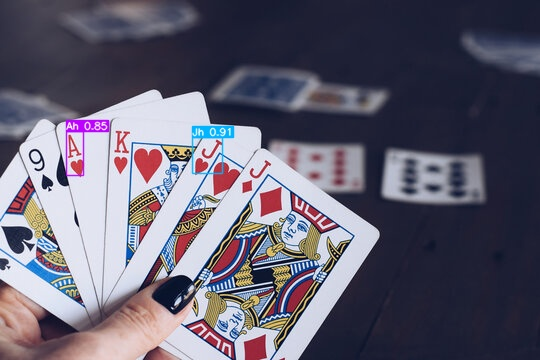

---

# Our YOLOv8m_comb in practice

There are definite examples that the model is not better than the others.

---
# Retraining the synthetic YOLOv8m_synth model

Using the well-performing YOLOv8m_synth as **base model** to **fine-tune** the model on the Hearts dataset with **13 classes**.

---
# Our YOLOv8m_tuned model

- Trained on YOLOv8 medium using **100** epochs
- Pretrained with **20 000 images** and 52 classes.
- Fine-tuned with **100 images** split 70/20/10 and 13 classes.
- **10 minutes training** time on NVIDIA RTX A2000 8GB Laptop GPU.

---
# Our YOLOv8m_tuned model statistics

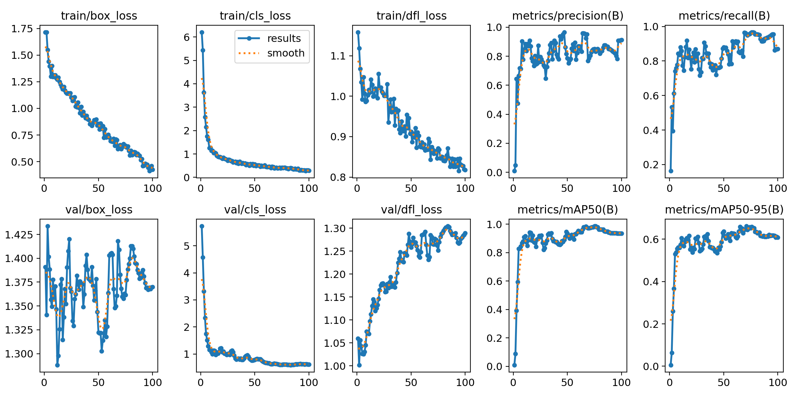

---
# Our YOLOv8m_tuned on test set

---

# Our YOLOv8m_tuned in practice

The model finally detects the Ace of hearts, but still mistakes other suits for Hearts.

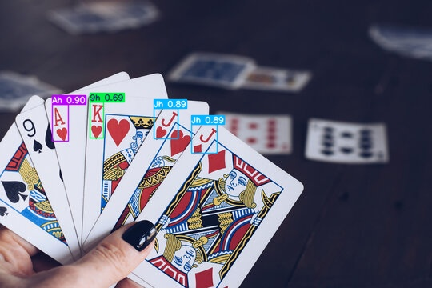

---

# Our YOLOv8m_tuned in practice

An improvement on the total number of Hearts recognized when the cards are stacked.

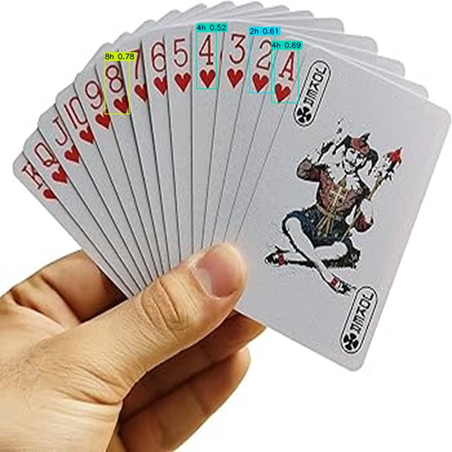

---

# Our YOLOv8m_tuned in practice

Good recognition between red and black cards.

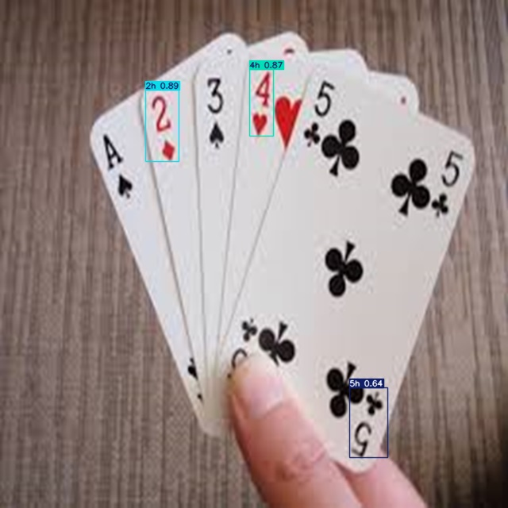

---

# Our YOLOv8m_tuned in practice

Example of **similar** recognition compared to the base synthetic model: 

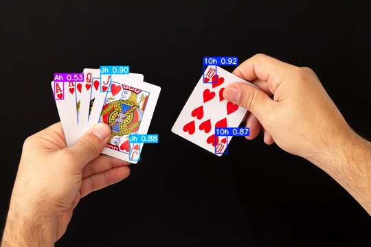

---

# Our YOLOv8m_tuned in practice

Example of **worse** recognition than the base synthetic model:

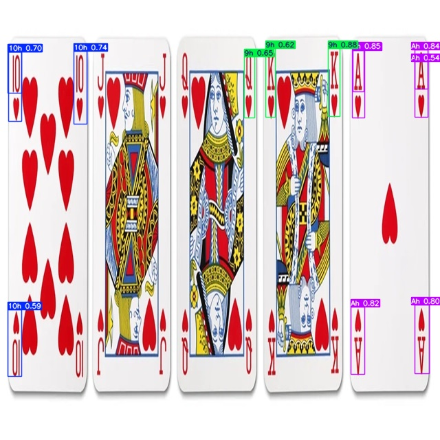

---
# Live Demo
---

# Conclusion

### More data, better results!

---

# Conclusion

- **Fine-tuning a synthetic model** seems like the **most promising** option if a **good amount of data** is available for fine-tuning.
- Combining two datasets **should be tested** with a more even distribution between the datasets, or a **bigger amount of data** in general.

---

# Positive examples

**YOLOv8m_comb** manages to find the Heart:

---

# Positive examples

**YOLOv8m_tuned** manages to find the Heart and the printed Ace of Hearts:

---

# Thank you for the attention!